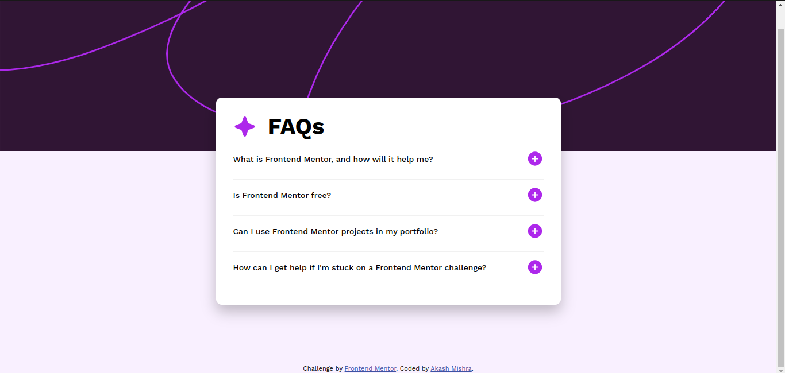
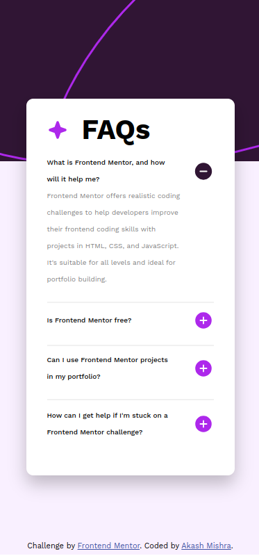

# Frontend Mentor - FAQ accordion solution

This is a solution to the [FAQ accordion challenge on Frontend Mentor](https://www.frontendmentor.io/challenges/faq-accordion-wyfFdeBwBz). Frontend Mentor challenges help you improve your coding skills by building realistic projects. 

## Table of contents

- [Overview](#overview)
  - [The challenge](#the-challenge)
  - [Screenshot](#screenshot)
  - [Links](#links)
- [My process](#my-process)
  - [Built with](#built-with)
  - [What I learned](#what-i-learned)
- [Author](#author)
- [Acknowledgments](#acknowledgments)

## Overview

### The challenge

Users should be able to:

- Hide/Show the answer to a question when the question is clicked
- Navigate the questions and hide/show answers using keyboard navigation alone
- View the optimal layout for the interface depending on their device's screen size
- See hover and focus states for all interactive elements on the page

### Screenshot

##### Desktop-view

##### MObile-view

### Links

- Solution URL: [https://github.com/akashmishrahaha/faq-accordion.git](https://your-solution-url.com)
- Live Site URL: [https://akashmishrahaha.github.io/faq-accordion.git/](https://your-live-site-url.com)

## My process

### Built with

- Semantic HTML5 markup
- CSS custom properties
- Flexbox
- CSS Grid
- Mobile-first workflow
- Javascript

### What I learned

I learned how to use EventListener in javascript and add responsiveness to the project.

## Author

- Frontend Mentor - [@akashmishrahaha](https://www.frontendmentor.io/profile/akashmishrahaha)
- Twitter - [@akashmishrahaha](https://www.twitter.com/akashmishrahaha)

## Acknowledgments

I would like to thanks my peer and frontend mentor community who guided me with this project.
